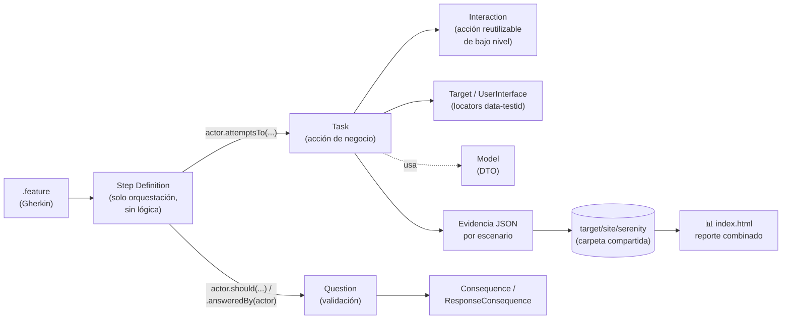
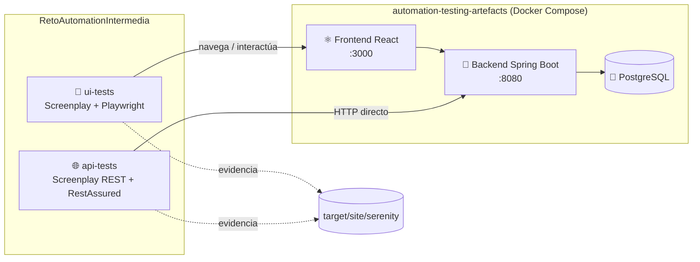
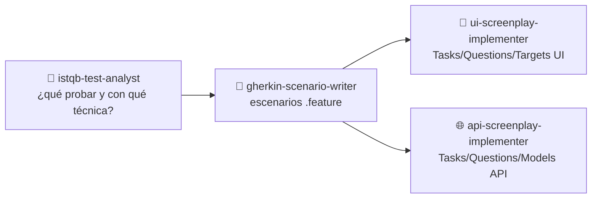

# 🎭 RetoAutomationIntermedia

**Framework de automatización UI + API con Serenity BDD + Screenplay Pattern**, construido para el reto técnico [`automation-testing-artefacts`](../automation-testing-artefacts).


---

## 📚 Índice

- [🎯 Qué es este proyecto](#-qué-es-este-proyecto)
- [🧰 Stack tecnológico](#-stack-tecnológico)
- [🏗️ Arquitectura](#️-arquitectura)
- [📁 Estructura del repositorio](#-estructura-del-repositorio)
- [🧩 Capas Screenplay explicadas](#-capas-screenplay-explicadas)
- [🥒 Escenarios y trazabilidad](#-escenarios-y-trazabilidad)
- [🏃 Runners disponibles](#-runners-disponibles)
- [🤖 Skills de Claude Code](#-skills-de-claude-code)
- [🚀 Cómo ejecutar la suite](#-cómo-ejecutar-la-suite)
- [📊 Reportes](#-reportes)
- [🐛 Hallazgos y bugs intencionales](#-hallazgos-y-bugs-intencionales)
- [📖 Documentación adicional](#-documentación-adicional)

---

## 🎯 Qué es este proyecto

Este repositorio **no prueba nada por sí mismo**: automatiza las pruebas del sistema
bajo prueba definido en el reto `automation-testing-artefacts` (un backend
Spring Boot + un frontend React con bugs intencionales, orquestados con
Docker Compose). Es un proyecto **Gradle multi-módulo** con dos suites
independientes que comparten arquitectura y convenciones:

| Módulo | Qué prueba | Cómo |
|---|---|---|
| 🔵 `api-tests` | Backend Spring Boot (`:8080`) | Screenplay REST + RestAssured |
| 🟢 `ui-tests` | Frontend React (`:3000`) | Screenplay + Playwright |

Todo el diseño sigue el **Screenplay Pattern** (Actors, Tasks, Interactions,
Questions) en vez de Page Object Model clásico, con trazabilidad explícita
a los criterios de aceptación del reto (`CA-API-*` / `CA-UI-*`) y cobertura
diseñada con técnicas ISTQB (partición de equivalencia, valores límite,
análisis de riesgo, error guessing).

## 🧰 Stack tecnológico

| Categoría | Herramienta | Versión | Por qué |
|---|---|---|---|
| Lenguaje | ☕ Java | 17 | Requerido por Serenity BDD 5.x / toolchain del proyecto |
| Build | 🐘 Gradle | 9.0 (wrapper) | Multi-módulo, sin necesidad de instalar Gradle localmente |
| BDD Runner | 🥒 Cucumber | 7.34.2 (JUnit 5 Platform Engine) | Gherkin ejecutable, sin el estilo JUnit4 `@CucumberOptions` |
| Reporting | 🎬 Serenity BDD | 5.3.4 | Reportes ricos por escenario + agregación multi-módulo |
| Patrón | 🎭 Screenplay Pattern | — | Actors/Tasks/Interactions/Questions, orientado a negocio |
| UI | 🎪 Playwright (Java) | 1.58.0 | Auto-wait nativo, sin `Thread.sleep`; vía `serenity-screenplay-playwright` |
| API | 🌐 RestAssured | 5.4.0 | Vía `serenity-screenplay-rest`, fluent assertions HTTP |
| Test runner | ✅ JUnit 5 | 5.10.2 | JUnit Platform Suite (`@Suite` + `cucumber-junit-platform-engine`) |
| Aserciones | 📐 AssertJ | 3.26.3 | Aserciones fluidas para `Question<Boolean>`/`Question<Long>` |
| Boilerplate | 🧬 Lombok | 1.18.36 | `@Data`/`@Builder` en modelos |
| Contenedores | 🐳 Docker / Docker Compose | — | Reproducibilidad total sin instalar nada localmente (ver [DOCKER.md](./DOCKER.md)) |
| IA | 🤖 Claude Code Skills | — | 4 skills reutilizables para extender la suite (ver más abajo) |

## 🏗️ Arquitectura

### Flujo Screenplay (de un escenario a un reporte)



### Relación entre módulos y el sistema bajo prueba



Ambos módulos son **independientes en ejecución** (podés correr solo uno)
pero **comparten reporte**: escriben su evidencia en la misma carpeta del
proyecto raíz y disparan la misma tarea `aggregate` de Serenity al
terminar — ver [`build.gradle`](./build.gradle).

## 📁 Estructura del repositorio

```
RetoAutomationIntermedia/
├── api-tests/                          # 🔵 Módulo Gradle — pruebas de API
│   └── src/
│       ├── main/java/com/reto/automation/api/
│       │   ├── tasks/                  # 1 endpoint = 1 Task
│       │   ├── interactions/           # Acciones reutilizables (medir tiempo, repetir llamadas)
│       │   ├── questions/              # Validaciones de respuesta HTTP
│       │   ├── models/                 # UserRequest / UserResponse (Lombok)
│       │   └── utils/                  # ApiConstants (base URL configurable)
│       └── test/
│           ├── java/com/reto/automation/api/
│           │   ├── stepsdefinitions/   # Solo orquestación
│           │   └── runners/            # 1 runner de regresión + 5 por feature
│           └── resources/
│               ├── serenity.conf
│               └── features/api/       # 5 archivos .feature, tags @CA-API-*
│
├── ui-tests/                           # 🟢 Módulo Gradle — pruebas de UI
│   └── src/
│       ├── main/java/com/reto/automation/ui/
│       │   ├── tasks/                  # Acciones de negocio (abrir app, llenar form...)
│       │   ├── interactions/           # Acciones reutilizables (select por texto visible)
│       │   ├── questions/              # Validaciones (tabla visible, error banner...)
│       │   ├── userinterfaces/         # Targets con locators data-testid
│       │   ├── models/                 # NewUser
│       │   └── utils/                  # UiConstants, TestDataProvider
│       └── test/
│           ├── java/com/reto/automation/ui/
│           │   ├── stepsdefinitions/   # Solo orquestación
│           │   └── runners/            # 1 runner de regresión + 4 por feature
│           └── resources/
│               ├── serenity.conf
│               └── features/ui/        # 4 archivos .feature, tags @CA-UI-*
│
├── docs/context/                       # 📖 Contexto arquitectónico (fuente para los skills)
│   ├── ui-reference-context.md
│   └── api-reference-context.md
│
├── .claude/skills/                     # 🤖 4 skills de Claude Code (ver sección dedicada)
│
├── build.gradle                        # Config raíz: toolchain, Serenity plugin, reporte combinado
├── settings.gradle                     # Módulos + resolver de toolchains (Foojay)
├── Dockerfile                          # Imagen de ejecución (JDK + Playwright)
├── docker-compose.tests.yml            # Compose secundario para correr la suite en contenedores
└── DOCKER.md                           # Guía completa de reproducibilidad con Docker
```

## 🧩 Capas Screenplay explicadas

| Capa | Responsabilidad | Regla de oro | Ejemplos en este repo |
|---|---|---|---|
| **Task** | Una acción de negocio completa | 🌐 API: 1 endpoint = 1 Task | `CreateUser`, `FillUserForm`, `OpenApp` |
| **Interaction** | Acción reutilizable de bajo nivel | No repetir lógica entre Tasks | `MeasureResponseTime`, `RepeatRequest`, `SelectDropdownOption` |
| **Question** | Una validación, responde `.answeredBy(actor)` | Reutilizable entre escenarios | `TheResponse.hasStatusCode()`, `UserIsListed`, `NoHorizontalOverflow` |
| **Target / UserInterface** | Locator de UI | 🚫 nunca `id`/`htmlFor` dinámicos, siempre `data-testid` | `UserFormUI`, `HomePageUI`, `UserListUI` |
| **Model** | DTO de datos (request/response o de formulario) | Lombok `@Data @Builder` | `UserRequest`, `UserResponse`, `NewUser` |
| **Utils** | Configuración centralizada | Nunca hardcodear URLs dispersas | `ApiConstants.BASE_URL`, `UiConstants.BASE_URL` |
| **Step Definition** | Orquestación pura | 🚫 cero lógica de negocio ni aserciones crudas | Delegan 100% en Tasks/Questions |

Convenciones completas (imports permitidos/prohibidos, ejemplos extraídos
de los proyectos de referencia) en
[`docs/context/api-reference-context.md`](./docs/context/api-reference-context.md)
y [`docs/context/ui-reference-context.md`](./docs/context/ui-reference-context.md).

## 🥒 Escenarios y trazabilidad

Cada `Feature` está etiquetada con el criterio de aceptación del reto que
cubre (`@CA-API-0X` / `@CA-UI-0X`) y su tipo ISTQB
(`@HappyPath` / `@Negative` / `@Edge` / `@DataVariation`):

| Feature | Criterio | Escenarios | Qué valida |
|---|---|:-:|---|
| `health.feature` | `CA-API-01` | 1 | Health check del backend |
| `users_crud.feature` | `CA-API-02` | 7 | CRUD completo + variación de roles |
| `users_intermittent_error.feature` | `CA-API-03` | 1 | Bug intencional: ~25% de 500 en `GET /api/users` |
| `users_latency.feature` | `CA-API-04` | 1 | Bug intencional: latencia de 2.5s en `POST /api/users` |
| `users_validation_bug.feature` | `CA-API-05` | 2 | Bug intencional: `PUT` no valida datos (`@KnownDefect`) |
| `app_load.feature` | `CA-UI-01` | 1 | Carga de la SPA y listado inicial |
| `user_form_dynamic_locators.feature` | `CA-UI-02` | 3 | Registro de usuario con locators `data-testid` estables |
| `loading_error_states.feature` | `CA-UI-03` | 1 | Banner de error ante falla intermitente del backend |
| `responsiveness_ambiguous.feature` | `CA-UI-04` | 4 | Criterio ambiguo — métricas propuestas (carga <3s, sin desborde en 375/768/1280px) |

**21 escenarios en total** (12 API + 9 UI) — 100% de los criterios
funcionales del reto cubiertos por al menos un escenario.

## 🏃 Runners disponibles

Cada módulo tiene **un runner de regresión** (corre todo el módulo, filtrado
a `@HappyPath` por defecto) **y un runner dedicado por feature** (corre
esa feature completa, sin filtrar), siguiendo el mismo patrón JUnit 5
Platform Suite + `SerenityReporter`:

<details>
<summary><strong>api-tests</strong> (6 runners)</summary>

| Runner | Alcance |
|---|---|
| `RegresionApiTest` | Todas las features de API, filtrado `@HappyPath` |
| `HealthTest` | `health.feature` |
| `UsersCrudTest` | `users_crud.feature` |
| `UsersIntermittentErrorTest` | `users_intermittent_error.feature` |
| `UsersLatencyTest` | `users_latency.feature` |
| `UsersValidationBugTest` | `users_validation_bug.feature` |

</details>

<details>
<summary><strong>ui-tests</strong> (5 runners)</summary>

| Runner | Alcance |
|---|---|
| `RegresionUiTest` | Todas las features de UI, filtrado `@HappyPath` |
| `AppLoadTest` | `app_load.feature` |
| `UserFormDynamicLocatorsTest` | `user_form_dynamic_locators.feature` |
| `LoadingErrorStatesTest` | `loading_error_states.feature` |
| `ResponsivenessAmbiguousTest` | `responsiveness_ambiguous.feature` |

</details>

> 💡 Correr `./gradlew :api-tests:test` ejecuta **todos** los runners del
> módulo (regresión + los 5 dedicados), por lo que cada escenario corre
> más de una vez por corrida completa — es intencional (se pidieron ambos
> tipos de runner), útil para poder filtrar por tag en el de regresión o
> aislar una sola feature con el dedicado.

## 🤖 Skills de Claude Code

Cuatro skills en [`.claude/skills/`](./.claude/skills) para extender esta
suite de forma consistente sin tener que memorizar todas las convenciones:



| Skill | Rol |
|---|---|
| 🧪 `istqb-test-analyst` | Analiza qué casos automatizar y con qué técnica ISTQB (partición de equivalencia, valores límite, análisis de riesgo, error guessing) |
| 📝 `gherkin-scenario-writer` | Redacta escenarios Gherkin de alto estándar, atómicos y trazables |
| 🎪 `ui-screenplay-implementer` | Implementa capas Screenplay de UI siguiendo `docs/context/ui-reference-context.md` |
| 🌐 `api-screenplay-implementer` | Implementa capas Screenplay de API siguiendo `docs/context/api-reference-context.md` |

Se activan automáticamente en Claude Code (CLI o extensión de IDE) al
abrir este proyecto, o explícitamente pidiéndolos por nombre.

## 🚀 Cómo ejecutar la suite

### Opción A — Local (Java 17 + Gradle)

```bash
cd ../automation-testing-artefacts && docker-compose up --build -d   # sistema bajo prueba
./gradlew clean build
./gradlew :api-tests:test :ui-tests:test --continue
```

> ⚠️ `--continue` es necesario: hay escenarios `@KnownDefect` que fallan a
> propósito contra el sistema real para documentar bugs — sin esa flag,
> Gradle detiene el build en el primer módulo que falla y el segundo nunca
> corre.

### Opción B — 100% Docker (sin instalar nada)

```bash
docker compose -f docker-compose.tests.yml build
docker compose -f docker-compose.tests.yml run --rm api-tests
docker compose -f docker-compose.tests.yml run --rm ui-tests
```

📘 Guía completa, con los problemas reales encontrados al verificarlo y
cómo se resolvieron (toolchain, propiedades del JVM forkeado, red del
navegador en contenedor): **[DOCKER.md](./DOCKER.md)**.

### ⚙️ Parámetros disponibles

| Propiedad | Por defecto | Descripción |
|---|---|---|
| `-Dapi.base.url` | `http://localhost:8080` | URL base del backend |
| `-Dui.base.url` | `http://localhost:3000` | URL base del frontend |
| `-Dplaywright.headless` | `false` local / `true` en Docker | Modo headless del navegador |
| `-Dplaywright.browser` | `chromium` | `chromium` \| `firefox` \| `webkit` |

## 📊 Reportes

| Reporte | Ruta | Contenido |
|---|---|---|
| 🎬 **Serenity BDD combinado** | `target/site/serenity/index.html` | API + UI en un único índice, con evidencia y capturas por paso |
| ✅ JUnit (api-tests) | `api-tests/build/reports/tests/test/index.html` | Reporte plano solo de API |
| ✅ JUnit (ui-tests) | `ui-tests/build/reports/tests/test/index.html` | Reporte plano solo de UI |

## 🐛 Hallazgos y bugs intencionales

Esta suite confirma automatizadamente **5 defectos** del sistema bajo
prueba (más 1 observación no reproducible) — detalle completo, severidad,
evidencia y propuesta de refinamiento de criterios ambiguos en el
[`REPORT_TEMPLATE.md`](../automation-testing-artefacts/REPORT_TEMPLATE.md)
del reto:

| ID | Componente | Severidad | Resumen |
|---|:-:|:-:|---|
| `BUG-API-001` | API | 🔴 Alta | `GET /api/users` falla ~25% de las veces (500) |
| `BUG-API-PERF` | API | 🟠 Media | `POST /api/users` demora 2.5s de forma sistemática |
| `BUG-API-002` | API | 🔴 Alta | `PUT /api/users/{id}` no valida datos inválidos |
| `BUG-UI-001` | UI | 🟠 Media | `id`/`htmlFor` dinámicos en el formulario |
| `BUG-UI-002` | UI | 🟠 Media | Tabla sin diseño responsivo (desborde en 375px) |

## 📖 Documentación adicional

- 🐳 [`DOCKER.md`](./DOCKER.md) — reproducibilidad completa con Docker
- 📘 [`docs/context/api-reference-context.md`](./docs/context/api-reference-context.md) — patrones de referencia API
- 📗 [`docs/context/ui-reference-context.md`](./docs/context/ui-reference-context.md) — patrones de referencia UI
- 📋 [`REPORT_TEMPLATE.md`](../automation-testing-artefacts/REPORT_TEMPLATE.md) — reporte de evaluación completo (estrategia, métricas, hallazgos)
